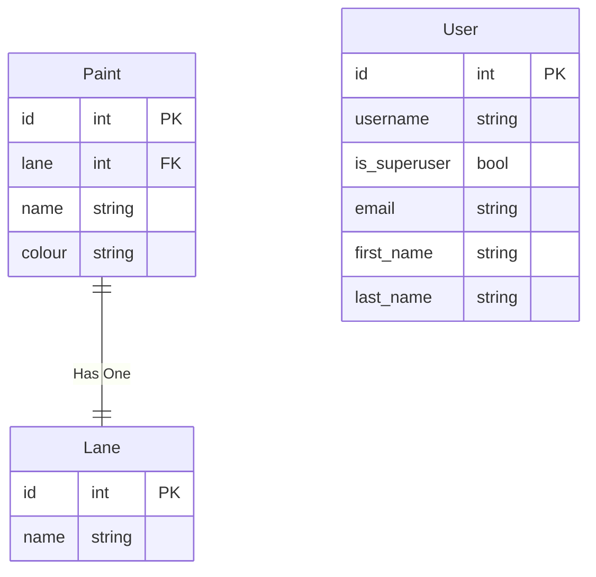
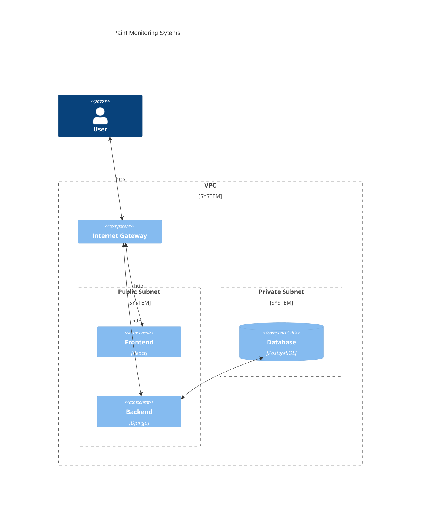

# IS21

## Take Home Assignment

The basic structure of this assignment is to create a web application and deploy
it to a cloud platform. My intention is to use Github Actions with Terraform to
deploy the application to AWS if there is time. The application will consist of
three services, a front end deployed to a docker container in an EC2 instance, a
back end deployed to a docker container in an EC2 instance, and a database
instance in RDS. The backend manages the database.

## Application Design

Requirements:

A kanban board where you can move several "Colours" between "Lanes" (Stock
levels). This implies a 1:1 relationship between a Colour, and a Lane. There are
two types of users: Managers and Painters, both want to use the app to view and
update the state.

Assumptions:

- Needs one admin user that can manage all other users.
- It's unclear to me what the relationship between the amount of paint (in
Liters) and the swim lanes (available, running low, out of stock) are.
    - As a result I will not automatically handle this relationship, ie. swim
    lane and amount of paint will be edited separately.
- Needs to support desktop and mobile layouts (reactive)
- There are a relatively small number of colours (not hundreds), so a mobile
view could stack the columns for ease

ER Diagram for the database schema:

Notes:
- I'm using Django for the backend and the User model is provided by the built
in Auth package.
- The colour field of the paint is used for rendering by the front end.
will

## Infrastructure

The infrastructure layout should look something like this:

## To Do

Stuff I haven't gotten to that I would improve in further iterations.

- [ ] A non-sqlite database
- [ ] Auto deploy on commit
- [ ] Proper session or token authentication
- [ ] Proper user management (currently need to use django management script)
- [x] Refactor front end to be modular.
- [ ] Switch from development server to Apache or Nginx
- [ ] tests
- [ ] E2E tests
- [ ] Drag and Drop
- [ ] Lane ordering
- [ ] Typing
- [ ] Proper Admin panel
...
- [ ] Separate front end and backend into eperate repos/services
